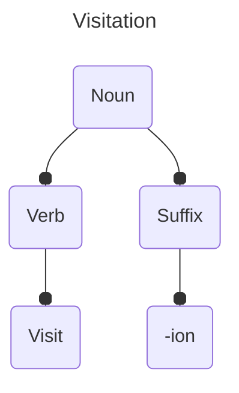
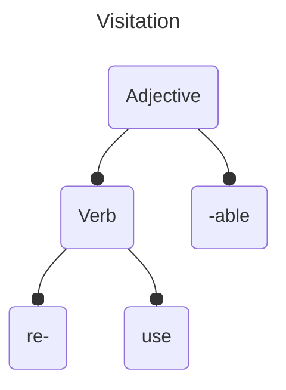
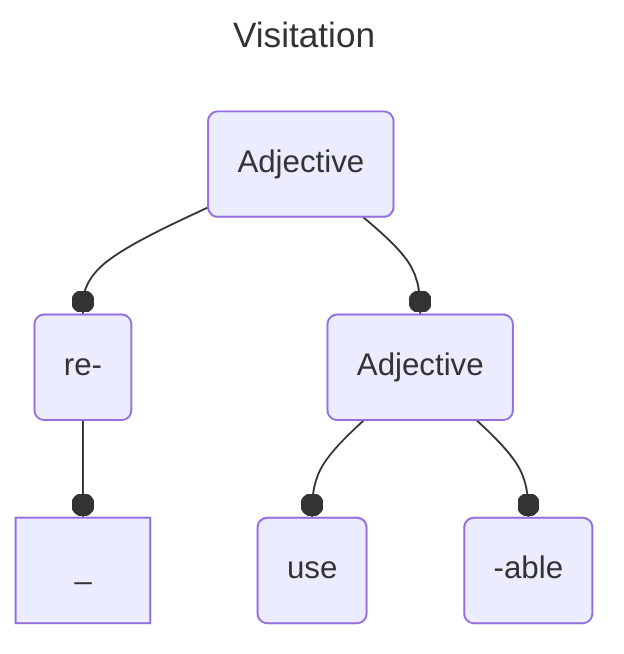

## Morphological Trees

- The branches do not use allomorphs of an affix
	- Visitation has the suffix `-ation` which is an allomorph of `-ion`

### Which tree to use?

For `Reusable`, the two possible bases are Reuse or useable, which are both normal words!

or

The correct version is the first one, since reuse is a verb, and re- can only attach to verbs. The second one is wrong since useable is an adjective, and you can `re-red` or `re-blossoming`

>[!note] Observe Question 3.2 in the textbook
>The second tree was obviously right since `undeny` is not a grammatical word. However in the case of `reusable`, then you'll get two valid bases! So, it really depends on the word.

>[!quote] Something our prof mentioned that might be important idk
> Please note that the words 'interest' and 'disinterest' can be used as **verbs** or **nouns**. This should not affect your morphological tree!

## Morphological Ambiguity
- Words that have multiple meanings (typically two) which reflect the possibility of drawing more than one morphological tree.
- E.g: untieable. The base could be `untie` or `tieable`
	- `Untie`-able means "able to be untied"
	- un-`tieable` means "unable to be tied"

## Derivation: Word Formation Processes
There are a lot of ways to form new words!
[[Affixes#Derivation and Inflection|Derivational affixation]] is one of them, and there are a lot more below, too. 

### Compounding
- Joining together two words into a new unit
-  Can use `-` hyphens / dashes
- Usually, with compounds, emphasis is on the first word. With non-compound words, it's on the second word. (**green**house vs green **house**) 
- Usually, it's two morphemes
- Usually, they form a noun, adjective, adverb, or verb
- Usually, the rightmost element determines the syntactic category of the entire compound
- Sometimes represented with hyphens

>[!examples] Here are some examples
> - Greenhouse (noun + noun; noun)
> - Parking ticket (verb + noun; noun)
> - Without (preposition)
> - Outsource (preposition + verb)
> - Virtue Signaling (noun + verb; verb)
> - Train station, Train station exit, South train station exit (all nouns)
> - Olive Garden (you get the idea)

Endocentric Compounds Usually relay meaning that is related to the head of the compound
- earthworm is a type of worm
- self-care is a type of care
- mother-in-law is a type of mother (this is one word, btw!)
Exocentric Compounds Aren't obvious or predictable 
- Bluebell is a... flower
- Boldface is a... typeface

### Reduplication
- Copying a free morpheme (or a part of it) to create new words
- `takbo` (run) --> `tatakbo` (will run)
- `orang` (man) --> `orangorang` (men)
Not really in English though.

### Zero Derivation / Conversion
- The process of assigning a word a new syntactic category.
- "Google" the number is also "Google" the verb

### Clipping
- Shortening words 
- Mathematics --> Math
- Sus (suspicious)  ඞඞඞ

### Blending
Merging the first part and second parts of words.
- Brunch (breakfast and lunch)
- Motel --> motor and hotel
- Smog --> Smoke and fog

### Backformation
- A word formed by removing a what appears to be a morpheme (suffix or prefix) but it actually does not
- It is almost impossible to tell which words were created through backformation w/o research
- `Donate` came from the word `Donation` by removing the "supposed" suffix `-ion` from it.
	- It came from the French word `Donacion` and us English speakers unconsciously assumed the `ion` at the end was removable. 
- In English, words ending in the suffix -_er_ or -_or_ are also susceptible to backformation where nouns such as _editor_ become misanalyzed to form verb forms like _edit_.

###  Acronyms and Abbreviations
- Abbreviations use the first letter from each word. Also called initialisms 
- Acronyms are words formed by abbreviations (and are pronounced as words)
	- NASA, NATO, BOGO (`buyonegetonfree`!), etc.

### Coinage
- Words formed from scratch 
- Kleenex, Kodak, and Teflon

### Eponymy
- Words created from names of people 
	- *Jacuzzi* named after Candido Jacuzzi
	- *watt* named after a scientist James Watt.

## Inflectional Processes
###  Internal Change
 - One non-morphemic element is substituted for another to mark grammatical changes.
 - Remember inflectional affixes? Adding an -`s` mades a noun plural, yeah? What about `foots`? That's not quite right, it's `feet`!
	 - Foot is replaced with feet to change it's grammatical meaning.

Ablaut A change in inflection using vowel structure instead of affixations
	- Swim and swam
	- Drink and drank
	- Goose and geese
	
### Suppletion
- When a morpheme is replaced by another (phonologically unrelated) morpheme.
- Occurs in verbs and adjectives

>[!examples]
>- good – better – best
>- bad – worse – worst

 