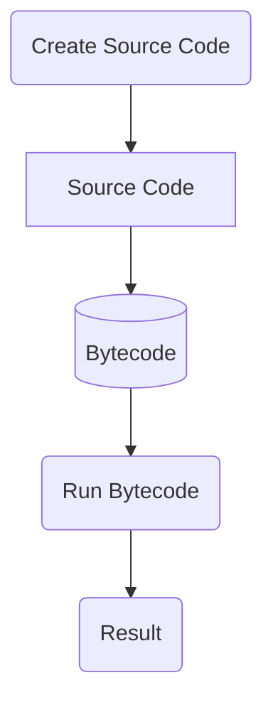
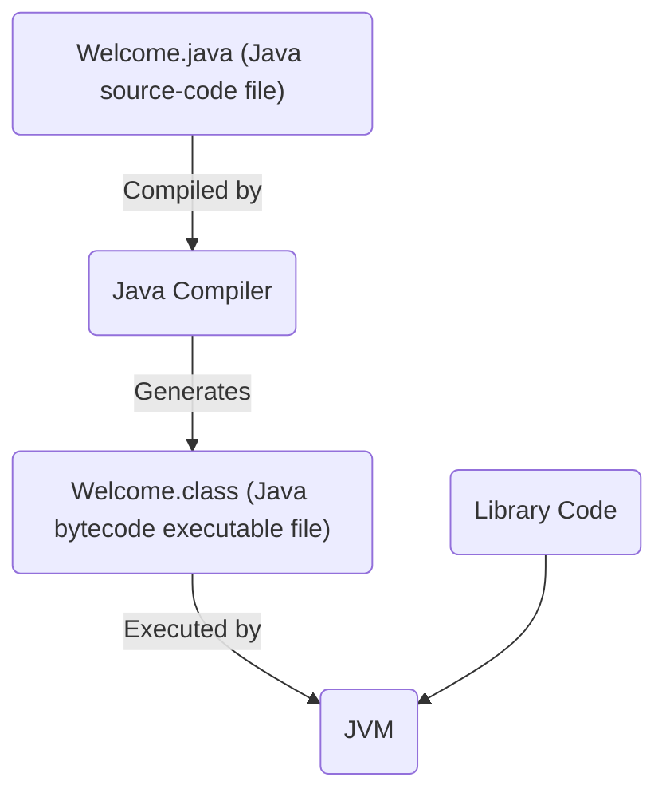

Refer to [[Java Compiler]]

Tutorials = labs

It will be known if we have a tutorial for the week or not (but it's good to go anyway. interesting)

its all about maintainable code


sdlc
- Software Development Life Cycle (SDLC)
- Scrum
- version control
	- git 

team members MUST be in the same tutorial
- 5 to 6 members in total (cuz people drop the course at times!)
- Minimum is 5 is good. 


the JVM is the interpreter, but it's also compiled as when the dev writes the code, they dont run the "source code" written in any text editor; its translated to something that can be executed. the translation is done by the compiler into *bytecode*. it's not machine code but similar (it's low-level code). 
- 1 line in java may become several lines of bytecode. 
but it's NOT machine code as it cannot be run; it requires an interpreter (that being the JVM) on a specific device.

Java is **portable** as the bytecode is universal (can be run on multiple platforms!) so long as the device has the JVM (but *that* is platform dependent!) 




javac = a program we install (the compiler). This is run any command line interface (CLI). mac = terminal. windows = command prompt. etc. 
`javac Welcome.java` compiles the java code into bytecode
- This also catches syntax errors before the code can be compiled

java = another "program" (the interpreter). Usually java and javac are installed together but they are seperate programs.
`java Welcome` runs the `Welcome` program





IDEs
- Finds syntax errors before compiling!
- Wow so nice!


#### Data Types
- Eight primitive types
	- Byte, char, short, int long, float, double, boolean 
- Anything that's not primitive is a *reference* data type

#todo include the table of the ranges of the data types. Could be useful!


### Classes
- more than just a "[[Compound (Composite) Data Types|CDT]]"
- `package`'s let you organize classes. it's like a folder at the end of the day.
- destructors we don't need. java uses a garbage collector that deallocates memory from objects that are not referenced anymore. 
- Constructors initialize objects.
- He calls fields "fields" so that's nice.

Object != Class. refer to [[Classes#Objects vs Classes]]

constructors without any arguments are useful when you want specific default values

in java, default values depend on the type of a field (that's if we don't initialize it, unlike c where it's just garbage)
- numbers are 0
- booleans are false
- for non-primitive types, the default value is `null`. 
	- At the end of a day, a non-primitive variable/field is an address / location
- variables declared within functions are local variables and not fields. 


## le stac et le heap

Consider
```java
// Point.java
package geometry;

class Point
{
	int x, y;
	public Point()
	{
		x = 0;
		y = 0;
	}
}

// main.java
package geometry;

class Main
{
	public static void main(string[] args)
	{
		Point p = new();
	}
}
```
- When we instance an object, the class object itself lives in the heap.
	- That means the fields are there too
- In the stack, the variable `p` that lives in main has a value of `101301` or something. this is an address to the heap!
![[Pasted image 20250505102545.png]]

Now let's do `q = p` inside of `main`! 
```java
public static void main(string[] args)
{
	Point p = new();
	Point q = p;
}
```

![[Pasted image 20250505102632.png]]

and lastly let's update the field of `x` to 5 by doing `p.x = 5` and print `q.x`
```java
public static void main(string[] args)
{
	Point p = new();
	Point q = p;
	p.x = 5;
	System.out.println(q.x);
}
```
 This would print out 5, as p and q are both pointing to the same object in the heap. Oh also in the heap the x would be swapped to 5 now yay.

#todo in java, variables are by default *package private* so fields can be accessed in the same package like any other public variable. That is interesting!

> You cannot have two constructors of the same signature (variable names are not part of the signature btw yeah that's kinda obvious though isn't it.)

```java
public Point(double x)
{
	x = x; // This refers to the variable from the *argument* and NOT the field.
	this.x = x; // That is how you refer to the field!
}
```

`this` = the object instance from which we are manipulating. Rawad calls it the *calling object*. the above example, `p` or `q` could be that calling object. 

we don't need `this` iff the field / local variable is not ambiguous. 

we might also use it in the following scenario:
- referencing the object, to pass into a method for example
- This will be useful later in the class but #todo i wanna know anyway. 

Calling `new` $\Leftrightarrow$  creating an object instance on the heap

on slide 10 we talk about string literals 

static = shared between all instances of the class. You can reference static members by just using the class name and the `.`  operator. 
- You can also use an instance to call static members... but that's ewww.

```java
public static void main(string[] args)
{
	Point p = new();
	Point q = p;

	Point.staticMethod(); // Correct!
	q.staticMethod(); // Also valid; also ew...
	
}
```

