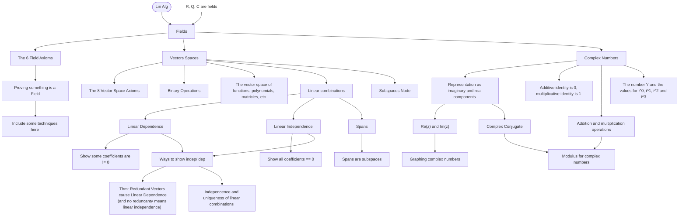

```mermaid
---

config:

  theme: redux

---

flowchart TD

    A(["Lin Alg <br>"]) --> n1["Fields <br>"]

    n1 --> n2["The 6 Field Axioms"] & n3["Vectors Spaces"] & n5["Complex Numbers <br>"]

    n3 --> n4["The 8 Vector Space Axioms <br>"] & n14["Binary Operations <br>"] & n18["The vector space of functions, polynomials, matricies, etc."] & n19["Linear combinations"] & n29["Subspaces Node"]

    n5 --> n11["Representation as imaginary and real components <br>"] & n15["Additive identity is 0; multiplicative identity is 1 <br>"] & n16["Addition and multiplication operations"] & n17@{ label: "The number 'i' and the values for i^0, i^1, i^2 and i^3" }

    n7["Complex Conjugate"] --> n8["Modulus for complex numbers"]

    n9["R, Q, C are fields <br>"] --> n1

    n6["Re(z) and Im(z)"] --> n10["Graphing complex numbers <br>"]

    n11 --> n6 & n7

    n12["Proving something is a Field"] --> n13["Include some techniques here <br>"]

    n2 --> n12

    n16 --> n8

    n19 --> n20["Linear Dependence"] & n21["Linear Independence"] & n27["Spans"]

    n20 --> n22["Show some coefficients are != 0"] & n24["Ways to show indep/ dep <br>"]

    n21 --> n23["Show all coefficients == 0"] & n24

    n24 --> n25@{ label: "<span style=\"padding-left:\">Thm: Redundant Vectors cause Linear Dependence<br>(and no reduncanty means linear independence)</span> <br>" } & n26["Indepencence and uniqueness of linear combinations <br>"]

    n27 --> n28["Spans are subspaces"]

    n17@{ shape: rect}

    n9@{ shape: text}

    n25@{ shape: rect}
```

